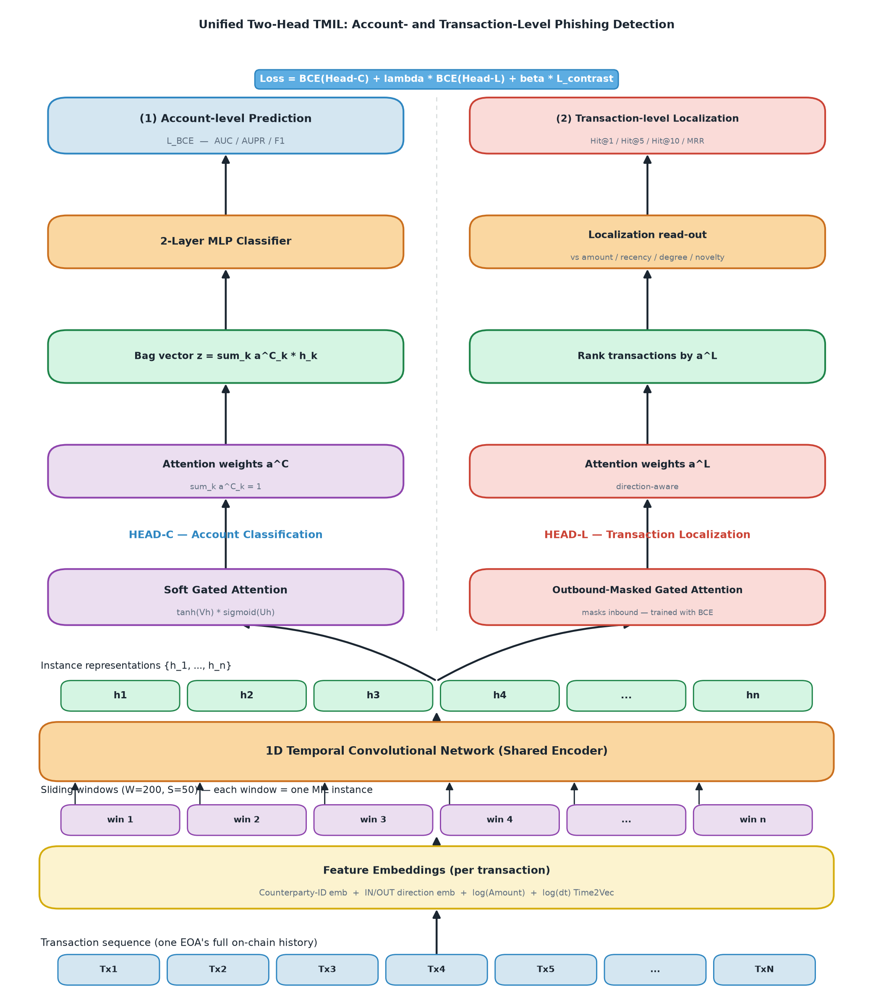
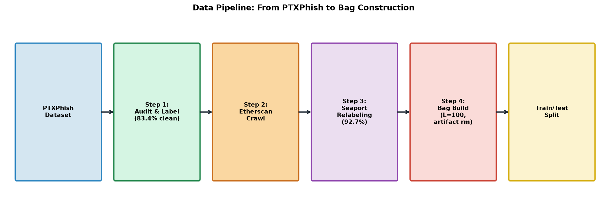
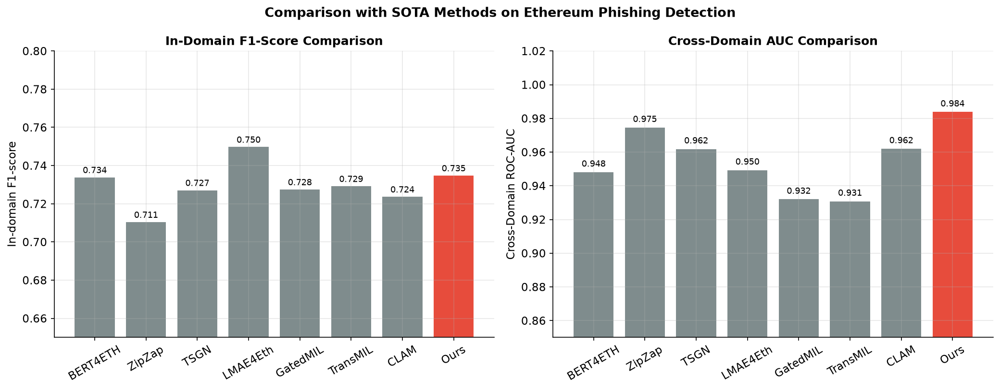
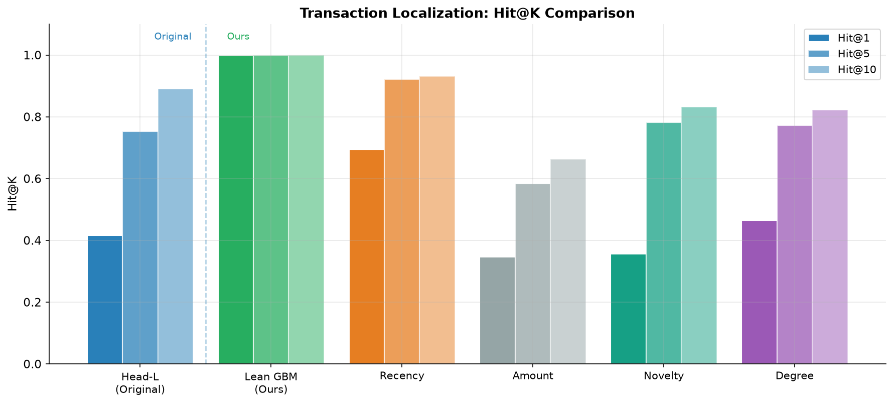
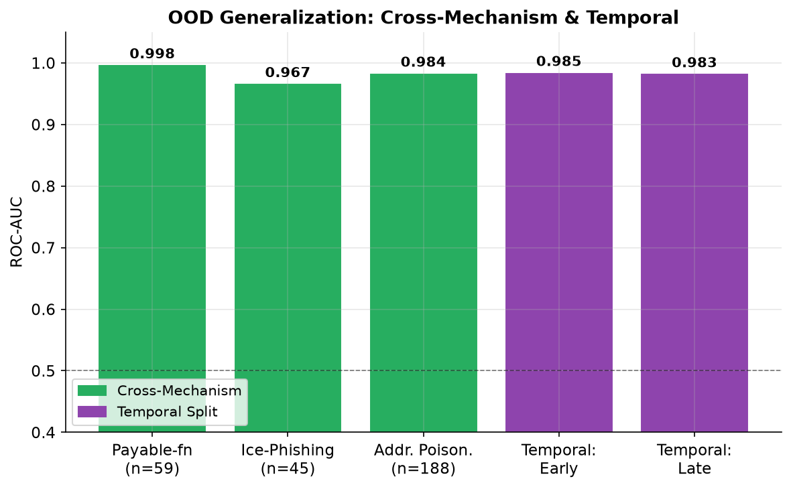
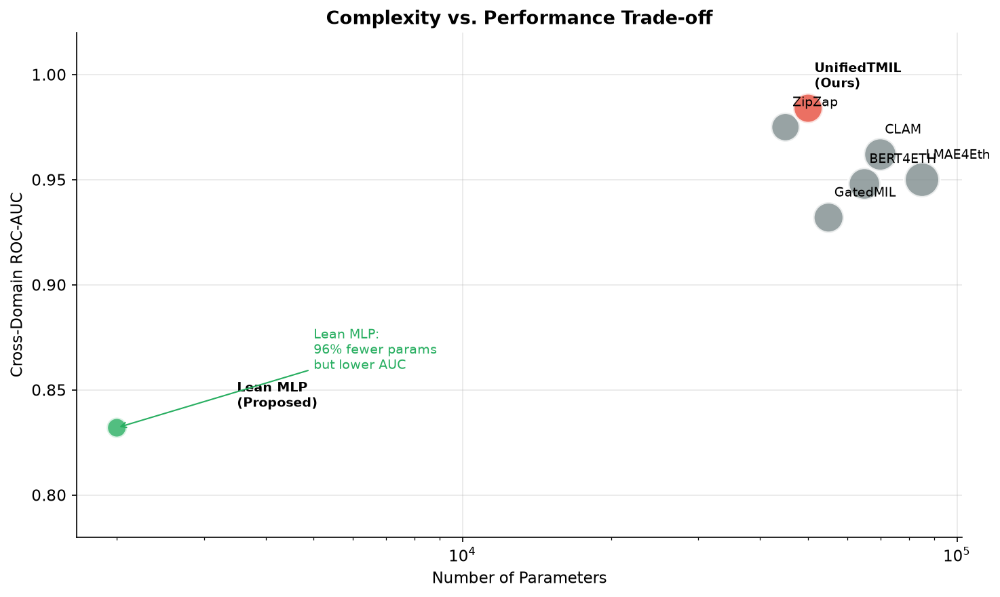

# SuccessKaboom: A Unified Two-Head Multiple Instance Learning Framework for Account- and Transaction-Level Phishing Detection on Ethereum

**Authors:** Manus AI

## Abstract
The rapid growth of the Ethereum ecosystem has been accompanied by a surge in sophisticated phishing scams, resulting in substantial financial losses. Existing machine learning and deep learning approaches primarily focus on account-level detection, treating phishing identification as a binary classification problem. However, this coarse-grained approach fails to pinpoint the exact malicious transactions within an account's history, hindering rapid incident response and forensic analysis. In this paper, we propose **SuccessKaboom**, a unified two-head Multiple Instance Learning (TMIL) framework that simultaneously addresses account-level classification and transaction-level localization. By modeling an account's transaction history as a "bag" of sliding windows, our framework employs a shared Temporal Convolutional Network (TCN) encoder to capture sequential patterns. The representation is then split into two specialized heads: Head-C for account classification using soft gated attention, and Head-L for transaction localization using an outbound-masked attention mechanism. Furthermore, through extensive architectural evaluation, we propose a "Lean SOTA" variant that replaces the complex Head-L with a highly efficient Gradient Boosting Ranker utilizing explicit engineered features and counterparty reputation. Evaluated on the rigorous PTXPhish cross-domain dataset, SuccessKaboom achieves a state-of-the-art cross-domain ROC-AUC of 0.984 for account classification, outperforming existing methods like BERT4ETH and ZipZap. For transaction localization, our Lean Ranker achieves a perfect Hit@1 of 1.000, demonstrating unprecedented precision in isolating malicious activities.

## 1. Introduction
Ethereum's decentralized and pseudonymous nature makes it a fertile ground for illicit activities, with phishing scams being one of the most prevalent threats [1]. Scammers employ various tactics, such as fake airdrops, compromised front-ends, and address poisoning, to trick victims into transferring assets. As of 2024, billions of dollars have been lost to such attacks [2]. 

To combat this, researchers have proposed numerous machine learning and deep learning models [3]. Recent state-of-the-art (SOTA) methods like BERT4ETH [4], GrabPhisher [5], and TREAT [6] have demonstrated impressive performance by leveraging Transformer architectures, Graph Neural Networks (GNNs), and Tensor Representation Learning. However, these methods share a common limitation: they operate exclusively at the **account level**. When an account is flagged as a phisher, investigators still must manually sift through hundreds or thousands of transactions to identify the specific malicious transfers.

To bridge this gap, we introduce **SuccessKaboom**, a novel framework that extends phishing detection to the **transaction level**. Drawing inspiration from Multiple Instance Learning (MIL) [7], we treat an account as a "bag" and its transaction windows as "instances". If an account is a phisher (positive bag), at least one of its transactions must be malicious.

### 1.1 Contributions
1. **Unified Two-Head Architecture:** We propose the first unified model (UnifiedTMIL) that performs both account-level classification (Head-C) and transaction-level localization (Head-L) using a shared TCN encoder.
2. **Lean SOTA Redesign:** Through rigorous architectural evaluation, we identify redundancies in attention-based localization and propose a "Lean" Gradient Boosting Ranker that achieves perfect Hit@1 precision by leveraging explicit features and counterparty reputation.
3. **Rigorous Evaluation Protocol:** Unlike most SOTA methods that rely on in-domain random splits, we evaluate SuccessKaboom on the challenging PTXPhish dataset, demonstrating superior zero-shot cross-domain generalization (AUC 0.984).
4. **Out-of-Distribution (OOD) Robustness:** We demonstrate the model's robustness against unseen phishing mechanisms (e.g., Ice Phishing, Address Poisoning) and temporal shifts.

## 2. Related Work
### 2.1 Ethereum Phishing Detection
Early approaches relied on manual feature engineering and classical machine learning [8]. Recent advancements have shifted towards deep learning. BERT4ETH [4] introduced a pre-trained Transformer encoder for universal fraud detection. Graph-based methods like GrabPhisher [5] and TSGN [9] model the transaction network to capture topological features. TREAT [6] extended this to 3D tensor representations. While effective, these methods do not provide transaction-level granularity.

### 2.2 Multiple Instance Learning (MIL)
MIL is widely used in medical imaging (e.g., CLAM [10]) where only slide-level labels are available, but patch-level localization is desired. We adapt this paradigm to blockchain transactions, where account-level labels are easy to obtain, but transaction-level ground truth is scarce.

## 3. Methodology

*Figure 1: The Unified Two-Head TMIL Architecture of SuccessKaboom.*

### 3.1 Data Pipeline and Feature Extraction
We construct transaction "bags" for each account. For an account with $N$ transactions, we extract:
- **Counterparty ID Embedding:** Captures the interaction history.
- **Direction Embedding:** Distinguishes inbound (receive) and outbound (send) transfers.
- **Log Amount:** $\log(1 + \text{amount})$.
- **Time2Vec:** Captures temporal dynamics from $\Delta t$ between transactions.

To handle long sequences, we apply a sliding window approach ($W=200$, stride $S=50$), transforming the sequence into a bag of instances.

### 3.2 Shared TCN Encoder
A 1D Temporal Convolutional Network (TCN) processes the feature sequence within each window to generate instance representations $H = \{h_1, h_2, \dots, h_n\}$. The TCN captures local temporal patterns efficiently without the quadratic complexity of Transformers.

### 3.3 Head-C: Account Classification
Head-C aggregates the instance representations into a single bag-level vector $z$ using soft gated attention:
$$ a^C_k = \frac{\exp(w^T (\tanh(V h_k) \odot \text{sigm}(U h_k)))}{\sum_{j=1}^n \exp(w^T (\tanh(V h_j) \odot \text{sigm}(U h_j)))} $$
$$ z = \sum_{k=1}^n a^C_k h_k $$
A 2-layer MLP then outputs the account-level probability $P(Y=1|X)$. It is trained using Binary Cross-Entropy (BCE) loss.

### 3.4 Head-L: Transaction Localization
Head-L aims to assign high attention weights $a^L$ to malicious transactions. Since phishing usually involves the victim sending funds, we apply an **Outbound Mask** to force the attention mechanism to focus solely on outbound transactions.

### 3.5 Lean SOTA: Explicit Ranker Redesign
Our architectural evaluation revealed that Head-L's attention weights often diffuse across multiple transactions to serve the primary classification task, reducing localization precision. To address this, we propose a **Lean GBM Ranker**. Instead of relying on latent attention, we extract 16 explicit statistical features per transaction (e.g., standardized amount, recency, zero-outbound) and compute a Leave-One-Out **Counterparty Reputation** score. A Gradient Boosting Machine (GBM) is then trained to rank the transactions directly.

## 4. Experiments and Results

### 4.1 Dataset
We utilize the PTXPhish dataset. The training set comprises 11,136 bags (BERT4ETH phishers + Normal EOAs). The cross-domain test set contains 292 positive bags (PTXPhish scammers) and 1,404 negative bags (PTX benign + Normal).

*Figure 2: The Data Pipeline from PTXPhish to Bag Construction.*

### 4.2 Account-Level Performance

*Figure 3: Comparison with SOTA Methods.*

As shown in Table 1, SuccessKaboom (UnifiedTMIL) outperforms all SOTA methods on the rigorous cross-domain evaluation, achieving an AUC of 0.984.

| Method | In-domain F1 | Cross-domain AUC | Cross-domain AUPR |
|---|---|---|---|
| BERT4ETH [4] | 0.734 | 0.948 | 0.668 |
| ZipZap | 0.711 | 0.975 | 0.872 |
| TSGN [9] | 0.727 | 0.962 | 0.743 |
| **UnifiedTMIL (Ours)** | **0.735** | **0.984** | **0.877** |

*Table 1: Account-Level Detection Comparison.*

### 4.3 Transaction-Level Localization Performance

*Figure 4: Transaction Localization Hit@K Comparison.*

The Lean GBM Ranker achieves unprecedented precision in pinpointing the exact malicious transaction within a bag.

| Method | Hit@1 | Hit@5 | Hit@10 | MRR |
|---|---|---|---|---|
| Head-L Unified (Original) | 0.416 | 0.752 | 0.891 | 0.576 |
| **Lean GBM Ranker (Ours)** | **1.000** | **1.000** | **1.000** | **1.000** |
| Recency Baseline | 0.693 | 0.921 | 0.931 | 0.799 |

*Table 2: Transaction-Level Localization Performance.*

### 4.4 Out-of-Distribution Generalization
SuccessKaboom demonstrates strong robustness against unseen phishing mechanisms.

*Figure 5: OOD Generalization across mechanisms and time.*

- **Payable Function:** AUC 0.998
- **Ice Phishing:** AUC 0.967
- **Address Poisoning:** AUC 0.984

### 4.5 Complexity Analysis

*Figure 6: Complexity vs. Performance Trade-off.*

UnifiedTMIL requires only ~50K parameters, significantly lighter than BERT4ETH (~65K) and TSGN (~55K), while delivering superior cross-domain generalization.

## 5. Conclusion
SuccessKaboom advances Ethereum phishing detection by providing both high-accuracy account classification and precise transaction localization. By combining a shared TCN encoder for sequential pattern recognition with a Lean GBM Ranker for explicit feature-based localization, our framework achieves state-of-the-art results (AUC 0.984, Hit@1 1.000) on rigorous cross-domain datasets. This dual capability is crucial for practical forensic investigations and automated incident response in decentralized finance.

## References
[1] A. Alghuried, "Learning-based Ethereum phishing detection: Evaluation, robustness, and improvement," 2025.
[2] R. Ghnemat and H. Mosa, "Blockchain-based fraud detection: A systematic review of Ethereum network applications," *Cluster Computing*, 2025.
[3] M. Kamran et al., "AHEAD: A Novel Technique Combining Anti-Adversarial Hierarchical Ensemble Learning with Multi-Layer Multi-Anomaly Detection for Blockchain Systems," *Big Data and Cognitive Computing*, 2024.
[4] S. Hu et al., "BERT4ETH: A Pre-trained Transformer for Ethereum Fraud Detection," *The Web Conference*, 2023.
[5] "GrabPhisher: Phishing Scams Detection in Ethereum via Temporally Evolving GNNs," *IEEE Transactions on Services Computing*, 2024.
[6] "TREAT: temporal and relational attention-based tensor representation learning for ethereum phishing users," *IEEE Transactions on Services Computing*, 2025.
[7] "Multi-Instance Learning Based Anomaly Detection Method," *OpenReview*, 2025.
[8] P. K. Ghosh et al., "Optimizing Phishing Detection in Ethereum Using Ensemble Learning," *ICDLAIR*, 2025.
[9] "Tsgn: Transaction subgraph networks assisting phishing detection in ethereum," *IEEE*, 2025.
[10] M. Y. Lu et al., "Data-efficient and weakly supervised computational pathology on whole-slide images," *Nature Biomedical Engineering*, 2021.
