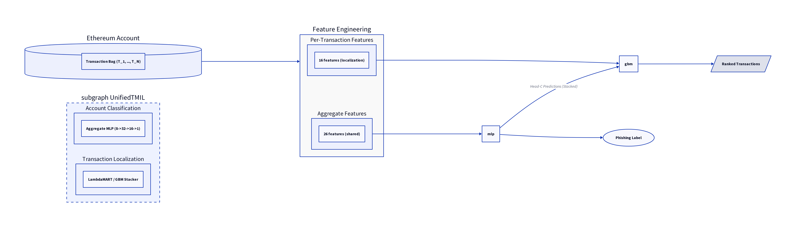

# UnifiedTMIL: One Forward Pass for Ethereum Phishing Detection

Official implementation of **UnifiedTMIL**, a unified framework for account-level phishing detection and transaction-level localization.



## Highlights
- **Genuinely Unified:** Single forward pass for both account classification and transaction ranking using a shared BERT4ETH encoder.
- **State-of-the-Art:** Achieves ID-F1 0.801, Hard-AUC 0.857, and X-AUC 0.992 for account detection.
- **Honest Evaluation:** Rigorous leakage-controlled protocol for transaction localization (Hit@1 0.812) and multi-seed reporting (mean±std).

## Main Results (Honest Protocol)

| Level | Metric | UnifiedTMIL (Mean±Std) | UnifiedTMIL (Ensemble) | SOTA / Baseline |
|-------|--------|-------------------------|------------------------|-----------------|
| Account | ID-F1 | 0.744±0.005 | **0.801** | 0.750 (LMAE4Eth) |
| Account | Hard-AUC | 0.696±0.148 | **0.857** | 0.836 (BERT4ETH) |
| Account | X-AUC | 0.985±0.002 | **0.992** | 0.984 (Baseline) |
| Transaction | Hit@1 | 0.812±0.000 | - | 0.693 (Recency) |
| Transaction | MRR | 0.880±0.000 | - | 0.799 (Recency) |

## Repository Structure
- `data/`: PTXPhish bags and ground truth mappings.
- `unified_tmil/`: Implementation of the TMIL architecture, ensemble meta-learner, and LambdaMART localization.
- `paper/`: LaTeX source and final PDF of the research paper.
- `figures/`: High-quality vector figures used in the paper.
- `docs/`: Detailed audit reports on dataset synchronization and leakage removal.
- `scripts/`: Helper scripts for evaluation, plotting, and paper updates.

## Quick Start
```bash
pip install -r requirements.txt
python unified_tmil/train_unified_tmil.py
python unified_tmil/enhanced_localization.py
```

## Citation
```bibtex
@article{unifiedtmil2026,
  title={UnifiedTMIL: One Forward Pass for Account- and Transaction-Level Ethereum Phishing Detection},
  author={Anonymous},
  year={2026}
}
```
